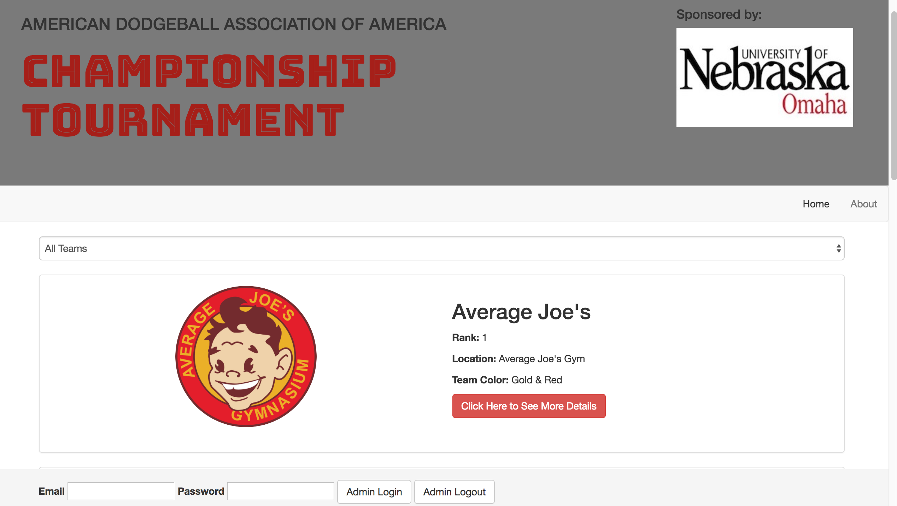
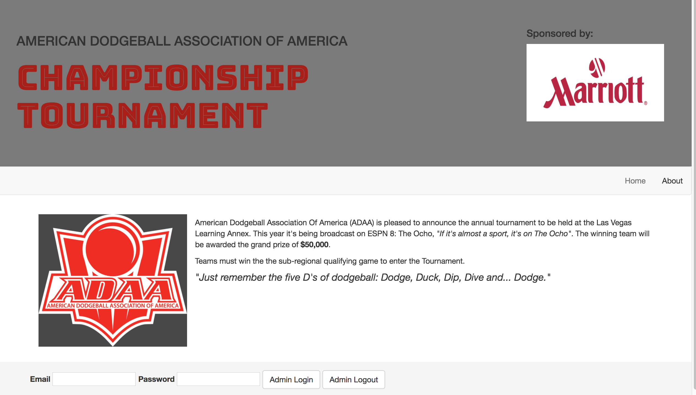

# ADAA Tournament
* [Firebase Hosted Site] (https://adaa-tournament.firebaseapp.com)

## By Nicole Santamaria

## User Stories

* As a user, I'd like to visit a page to see a list of all dodgeball teams.
* As a user, I'd like to click a team's entry in the list to visit their profile page, which should include more details about them.
* As a user, I'd like the option to visit an "About" page that explains what the tournament is, and what they do.
* As a user, I'd like all data persisted in a database, so it's always there when I need it.
* As a user, I'd like to filter the list of teams by their rank.
* As an administrator, I want to add new users to the association. (User authentication is established).
* As an administrator, I want to edit user profiles, in case I make a mistake, or need to update their details.
* As an administrator, need the option to delete a team, in case they leave the association.

## Prerequisites

You will need the following things properly installed on your computer.

* [Git](https://git-scm.com/)
* [Node.js](https://nodejs.org/) (with NPM)
* [AngularCLI](https://cli.angular.io/)
* [Firebase](https://firebase.google.com/)

## Installation

* `git clone https://github.com/nrsantamaria/adaa-tournament`
* `cd adaa-tournament`
* `npm install`
* `bower install bootstrap --save`

## Firebase Integration

* Create a firebase account at `https://firebase.google.com`
* Add a new project to your firebase account
* Create a file in the app folder labeled api-keys.ts
* Add the following to your api-keys file:

```
export var masterFirebaseConfig = {
    apiKey: "xxxx",
    authDomain: "xxxx.firebaseapp.com",
    databaseURL: "https://xxxx.firebaseio.com",
    storageBucket: "xxxx.appspot.com",
    messagingSenderId: "xxxx"
  };
```

* User authentication is enabled for the admin route. Be sure to turn on the email sign in method and add a user under the users tab.

## Development server

Run `ng serve` for a dev server. Navigate to `http://localhost:4200/`. The app will automatically reload if you change any of the source files.

## Useful Tips

* To review content in atom with TypeScript Package install the following: `apm install atom-typescript`
* If you receive the following error: Error: Can't resolve 'promise-polyfill', Run `npm install promise-polyfill --save-exact`
* If you get some other weird firebase related error use the following to find out what file is out of date. Run `npm list`

## Support and Contact Details
* Please contact Nicole Santamaria at NicoleRSantamaria@gmail.com if you have any questions.

## License
This software is licensed under MIT license.

Copyright (c) 2017 Nicole Santamaria



